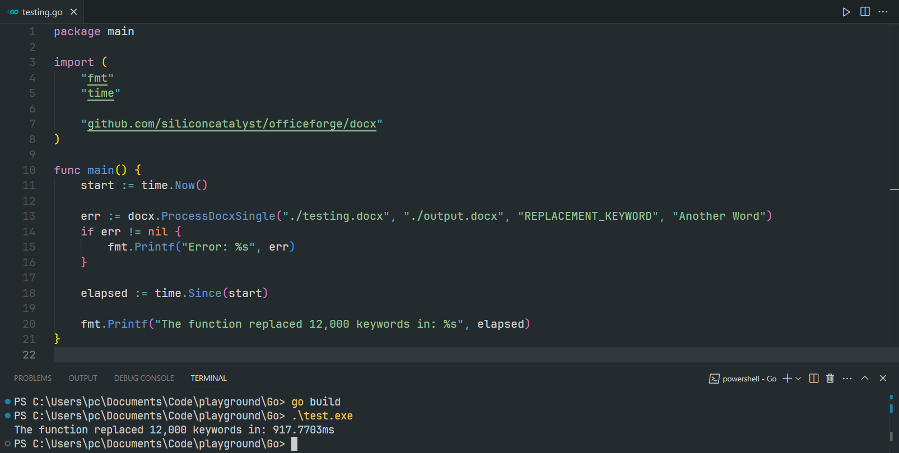
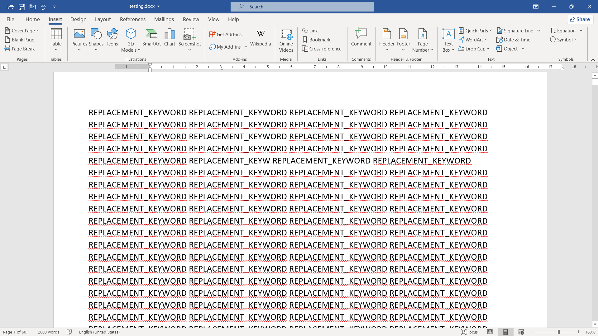

# OfficeForge

[](https://go.dev/)
[](https://github.com/siliconcatalyst/officeforge/releases)
[](https://goreportcard.com/report/github.com/siliconcatalyst/officeforge)
[](https://opensource.org/licenses/MIT)

**OfficeForge** – A pure Go library and CLI for generating Word, Excel, and PowerPoint documents with zero external dependencies. Built on the standard library for maximum portability, security, and control.

## ✨ Features

- 🚀 **Zero Dependencies** – Pure Go using only `zip`, `xml`, and `bytes`
- ⚡ **High Performance** – Process 12,000+ word replacements per second
- 🔧 **Dual Interface** – Use as a Go library or standalone CLI tool
- 🌍 **Cross-Platform** – Works on Windows, macOS, and Linux
- 🔒 **Secure** – No external dependencies means smaller attack surface
- 📦 **Easy Integration** – Works with any programming language via CLI

## 📊 Performance

- **12,000 words replaced in ~1 second**



<details>
<summary>View test document details</summary>




</details>

## 📥 Installation

### As a CLI Tool (Recommended for Non-Go Users)

**Option 1: Download Pre-built Binary**

Download the latest binary for your platform from the [Releases page](https://github.com/siliconcatalyst/officeforge/releases):

```bash
# macOS (Apple Silicon)
curl -L https://github.com/siliconcatalyst/officeforge/releases/latest/download/officeforge-darwin-arm64 -o officeforge
chmod +x officeforge
sudo mv officeforge /usr/local/bin/

# macOS (Intel)
curl -L https://github.com/siliconcatalyst/officeforge/releases/latest/download/officeforge-darwin-amd64 -o officeforge
chmod +x officeforge
sudo mv officeforge /usr/local/bin/

# Linux
curl -L https://github.com/siliconcatalyst/officeforge/releases/latest/download/officeforge-linux-amd64 -o officeforge
chmod +x officeforge
sudo mv officeforge /usr/local/bin/

# Windows (PowerShell)
# Download officeforge-windows-amd64.exe from releases
# Add to PATH or run directly
```

**Option 2: Install via Go**

```bash
go install github.com/siliconcatalyst/officeforge/cmd/officeforge@latest
```

### As a Go Library

```bash
go get github.com/siliconcatalyst/officeforge@latest
```

## 🚀 Quick Start

### CLI Usage

```bash
# Single keyword replacement
officeforge single \
  --input template.docx \
  --output contract.docx \
  --key "{{NAME}}" \
  --value "John Doe"

# Multiple replacements from JSON
officeforge multi \
  --input template.docx \
  --output contract.docx \
  --data replacements.json

# Batch generation from CSV
officeforge batch \
  --input template.docx \
  --output ./contracts \
  --data employees.csv \
  --pattern "{NAME}_contract.docx"
```

### Library Usage

```go
import "github.com/siliconcatalyst/officeforge/docx"

// Single replacement
docx.ProcessDocxSingle("template.docx", "output.docx", "{{NAME}}", "John Doe")

// Multiple replacements
replacements := map[string]string{
    "{{NAME}}":  "John Doe",
    "{{EMAIL}}": "john@example.com",
    "{{DATE}}":  "2024-12-04",
}
docx.ProcessDocxMulti("template.docx", "output.docx", replacements)
```

## 📖 CLI Documentation

### Commands

| Command | Description |
|---------|-------------|
| `single` | Replace a single keyword in a template |
| `multi` | Replace multiple keywords from a JSON file |
| `batch` | Generate multiple documents from CSV/JSON data |
| `version` | Display version information |
| `help` | Show help message |

### Single Replacement

Replace one keyword in a template document.

```bash
officeforge single \
  --input template.docx \
  --output result.docx \
  --key "{{CLIENT}}" \
  --value "Acme Corporation"
```

**Flags:**
- `--input, -i`: Path to template DOCX file (required)
- `--output, -o`: Path for output file (required)
- `--key, -k`: Keyword to replace (required)
- `--value, -v`: Replacement value (required)

### Multiple Replacements

Replace multiple keywords using a JSON configuration file.

**Create `data.json`:**
```json
{
  "{{NAME}}": "John Doe",
  "{{EMAIL}}": "john@example.com",
  "{{PHONE}}": "555-1234",
  "{{COMPANY}}": "Tech Solutions Inc.",
  "{{DATE}}": "2024-12-04"
}
```

**Run command:**
```bash
officeforge multi \
  --input template.docx \
  --output completed_form.docx \
  --data data.json
```

**Flags:**
- `--input, -i`: Path to template DOCX file (required)
- `--output, -o`: Path for output file (required)
- `--data, -d`: Path to JSON file with replacements (required)

### Batch Processing

Generate multiple documents from CSV or JSON data.

**Create `employees.csv`:**
```csv
NAME,EMAIL,PHONE,POSITION,START_DATE
John Doe,john@company.com,555-1234,Engineer,2024-01-15
Jane Smith,jane@company.com,555-5678,Manager,2024-02-20
Bob Johnson,bob@company.com,555-9999,Designer,2024-03-10
```

**Run command:**
```bash
officeforge batch \
  --input contract_template.docx \
  --output ./contracts \
  --data employees.csv \
  --pattern "{NAME}_contract.docx"
```

**With JSON data (`records.json`):**
```json
[
  {
    "{{NAME}}": "John Doe",
    "{{EMAIL}}": "john@example.com",
    "{{POSITION}}": "Software Engineer"
  },
  {
    "{{NAME}}": "Jane Smith",
    "{{EMAIL}}": "jane@example.com",
    "{{POSITION}}": "Product Manager"
  }
]
```

```bash
officeforge batch \
  --input template.docx \
  --output ./output \
  --data records.json
```

**Flags:**
- `--input, -i`: Path to template DOCX file (required)
- `--output, -o`: Output directory path (required)
- `--data, -d`: Path to CSV or JSON file (required)
- `--pattern, -p`: File naming pattern (optional, defaults to `document_N.docx`)

**Pattern Examples:**
- `{NAME}_contract.docx` → `John_Doe_contract.docx`
- `{EMAIL}_{DATE}.docx` → `john@example.com_2024-12-04.docx`
- `invoice_{ID}.docx` → `invoice_001.docx`

## 📚 Library Documentation

### Import

```go
import "github.com/siliconcatalyst/officeforge/docx"
```

### Function 1: ProcessDocxSingle

Replace a single keyword in a document.

```go
func ProcessDocxSingle(inputPath, outputPath, keyword, replacement string) error
```

**Example:**
```go
err := docx.ProcessDocxSingle(
    "contract_template.docx",
    "contract_john_smith.docx",
    "{{CLIENT_NAME}}",
    "John Smith",
)
if err != nil {
    log.Fatal(err)
}
```

**Use Cases:**
- Quick personalization of documents
- Testing individual replacements
- Simple one-off document generation

### Function 2: ProcessDocxMulti

Replace multiple keywords in a document.

```go
func ProcessDocxMulti(inputPath, outputPath string, replacements map[string]string) error
```

**Example:**
```go
contractData := map[string]string{
    "{{CLIENT_NAME}}":     "John Smith",
    "{{CLIENT_ADDRESS}}":  "123 Main St, City, State 12345",
    "{{CONTRACT_DATE}}":   "2024-12-04",
    "{{CONTRACT_AMOUNT}}": "$5,000",
    "{{PROJECT_NAME}}":    "Website Development",
    "{{DEADLINE}}":        "2024-12-31",
}

err := docx.ProcessDocxMulti(
    "contract_template.docx",
    "john_smith_contract.docx",
    contractData,
)
```

**Use Cases:**
- Mail merge operations
- Form filling
- Complete document population
- Contract generation

### Function 3: ProcessDocxMultipleRecords

Generate multiple documents with sequential naming.

```go
func ProcessDocxMultipleRecords(
    inputPath, outputDir string,
    records []map[string]string,
    fileNamePattern string,
) error
```

**Example:**
```go
records := []map[string]string{
    {
        "{{CLIENT_NAME}}":     "John Smith",
        "{{CONTRACT_DATE}}":   "2024-12-04",
        "{{CONTRACT_AMOUNT}}": "$5,000",
    },
    {
        "{{CLIENT_NAME}}":     "Jane Doe",
        "{{CONTRACT_DATE}}":   "2024-12-05",
        "{{CONTRACT_AMOUNT}}": "$7,500",
    },
}

// Creates: contract_1.docx, contract_2.docx
err := docx.ProcessDocxMultipleRecords(
    "contract_template.docx",
    "./contracts",
    records,
    "contract_%d.docx",
)
```

**Use Cases:**
- Bulk document generation
- Certificate creation
- Invoice generation
- Report automation

### Function 4: ProcessDocxMultipleRecordsWithNames

Generate multiple documents with custom naming function.

```go
func ProcessDocxMultipleRecordsWithNames(
    inputPath, outputDir string,
    records []map[string]string,
    nameFunc func(map[string]string, int) string,
) error
```

**Example:**
```go
records := []map[string]string{
    {
        "{{INVOICE_NUMBER}}": "INV-2024-001",
        "{{CLIENT_NAME}}":    "ABC Corporation",
        "{{TOTAL_AMOUNT}}":   "$2,500.00",
    },
    {
        "{{INVOICE_NUMBER}}": "INV-2024-002",
        "{{CLIENT_NAME}}":    "XYZ Industries",
        "{{TOTAL_AMOUNT}}":   "$3,750.00",
    },
}

nameFunc := func(record map[string]string, index int) string {
    return record["{{INVOICE_NUMBER}}"] + ".docx"
}

// Creates: INV-2024-001.docx, INV-2024-002.docx
err := docx.ProcessDocxMultipleRecordsWithNames(
    "invoice_template.docx",
    "./invoices",
    records,
    nameFunc,
)
```

**Use Cases:**
- Custom file naming conventions
- Date-based organization
- Client-specific naming
- Complex naming logic

## 🎯 Use Cases

| Use Case | Recommended Function | CLI Command |
|----------|---------------------|-------------|
| Single personalized letter | `ProcessDocxSingle` | `single` |
| Complete contract | `ProcessDocxMulti` | `multi` |
| 100 employee certificates | `ProcessDocxMultipleRecords` | `batch` |
| Invoices with custom IDs | `ProcessDocxMultipleRecordsWithNames` | `batch` with pattern |
| Monthly reports | `ProcessDocxMulti` | `multi` |
| Mail merge | `ProcessDocxMultipleRecords` | `batch` |

## 🔧 Integration Examples

### Python

```python
import subprocess
import json

# Single replacement
subprocess.run([
    "officeforge", "single",
    "--input", "template.docx",
    "--output", "output.docx",
    "--key", "{{NAME}}",
    "--value", "John Doe"
])

# Multiple replacements
data = {
    "{{NAME}}": "John Doe",
    "{{EMAIL}}": "john@example.com"
}
with open("data.json", "w") as f:
    json.dump(data, f)

subprocess.run([
    "officeforge", "multi",
    "--input", "template.docx",
    "--output", "output.docx",
    "--data", "data.json"
])
```

### Node.js

```javascript
const { execSync } = require('child_process');
const fs = require('fs');

// Single replacement
execSync(`officeforge single --input template.docx --output output.docx --key "{{NAME}}" --value "John Doe"`);

// Multiple replacements
const data = {
  "{{NAME}}": "John Doe",
  "{{EMAIL}}": "john@example.com"
};
fs.writeFileSync('data.json', JSON.stringify(data));
execSync(`officeforge multi --input template.docx --output output.docx --data data.json`);
```

### PHP

```php
<?php
// Single replacement
shell_exec('officeforge single --input template.docx --output output.docx --key "{{NAME}}" --value "John Doe"');

// Multiple replacements
$data = [
    "{{NAME}}" => "John Doe",
    "{{EMAIL}}" => "john@example.com"
];
file_put_contents('data.json', json_encode($data));
shell_exec('officeforge multi --input template.docx --output output.docx --data data.json');
?>
```

### Bash Script

```bash
#!/bin/bash

# Batch process from CSV
officeforge batch \
  --input template.docx \
  --output ./contracts \
  --data employees.csv \
  --pattern "{NAME}_contract.docx"

# Check exit status
if [ $? -eq 0 ]; then
    echo "✓ Documents generated successfully"
else
    echo "✗ Error generating documents"
    exit 1
fi
```

## 💡 Best Practices

### Keyword Formatting

✅ **Good:**
- `{{NAME}}` - Clear delimiters
- `[[EMAIL]]` - Unique brackets
- `__PHONE__` - Underscores

❌ **Avoid:**
- `NAME` - Could match regular text
- `<NAME>` - Conflicts with XML
- `{NAME}` - Single braces might appear naturally

### Template Design

1. **Use descriptive keywords**
   ```
   ✅ {{CLIENT_FULL_NAME}}
   ❌ {{N}}
   ```

2. **Keep keywords visible**
   - Use ALL CAPS or special formatting
   - Makes templates easy to review

3. **Test with sample data**
   ```bash
   officeforge single \
     --input template.docx \
     --output test.docx \
     --key "{{TEST}}" \
     --value "SAMPLE"
   ```

### Error Handling

```go
// Check if template exists
if _, err := os.Stat("template.docx"); os.IsNotExist(err) {
    log.Fatal("Template file not found")
}

// Ensure output directory exists
os.MkdirAll("./output", 0755)

// Process with error handling
err := docx.ProcessDocxMulti("template.docx", "output.docx", data)
if err != nil {
    log.Printf("Processing failed: %v", err)
    // Handle error appropriately
}
```

## 🔍 Troubleshooting

### Keywords not replaced

**Cause:** Keyword spelling mismatch or formatting issues

**Solution:**
```bash
# Check your template for exact keyword spelling
# Ensure no extra spaces: "{{ NAME }}" vs "{{NAME}}"
```

### Output file not created

**Cause:** Missing output directory or insufficient permissions

**Solution:**
```bash
# Create output directory first
mkdir -p ./output

# Check permissions
ls -la ./output
```

### "Template file not found"

**Cause:** Incorrect file path

**Solution:**
```bash
# Use absolute paths
officeforge single --input /full/path/to/template.docx ...

# Or relative paths from current directory
officeforge single --input ./templates/template.docx ...
```

### Memory issues with large batches

**Solution:** Process in smaller chunks
```go
// Instead of processing 10,000 records at once
// Process in batches of 100
for i := 0; i < len(allRecords); i += 100 {
    batch := allRecords[i:min(i+100, len(allRecords))]
    docx.ProcessDocxMultipleRecords(template, output, batch, pattern)
}
```

## 🗺️ Roadmap

- [x] Word (DOCX) support
- [x] CLI tool
- [x] Batch processing
- [ ] Excel (XLSX) support
- [ ] PowerPoint (PPTX) support
- [ ] Image insertion
- [ ] Table manipulation
- [ ] Conditional content
- [ ] Package managers (Homebrew, Chocolatey, Scoop)

## 🤝 Contributing

Contributions are welcome! Please feel free to submit a Pull Request.

1. Fork the repository
2. Create your feature branch (`git checkout -b feature/amazing-feature`)
3. Commit your changes (`git commit -m 'Add amazing feature'`)
4. Push to the branch (`git push origin feature/amazing-feature`)
5. Open a Pull Request

### Development Setup

```bash
# Clone the repository
git clone https://github.com/siliconcatalyst/officeforge.git
cd officeforge

# Install dependencies
go mod download

# Run tests
cd tests
go test -v

# Or use gotestsum for prettier output
gotestsum --format testname
```

## 📄 License

MIT License - see [LICENSE](LICENSE) file for details

## 🙏 Support

- 📖 [Documentation](https://github.com/siliconcatalyst/officeforge/wiki)
- 🐛 [Issue Tracker](https://github.com/siliconcatalyst/officeforge/issues)

---

**Made with ❤️ by the OfficeForge team**

If you find this project useful, please consider giving it a ⭐ on GitHub!